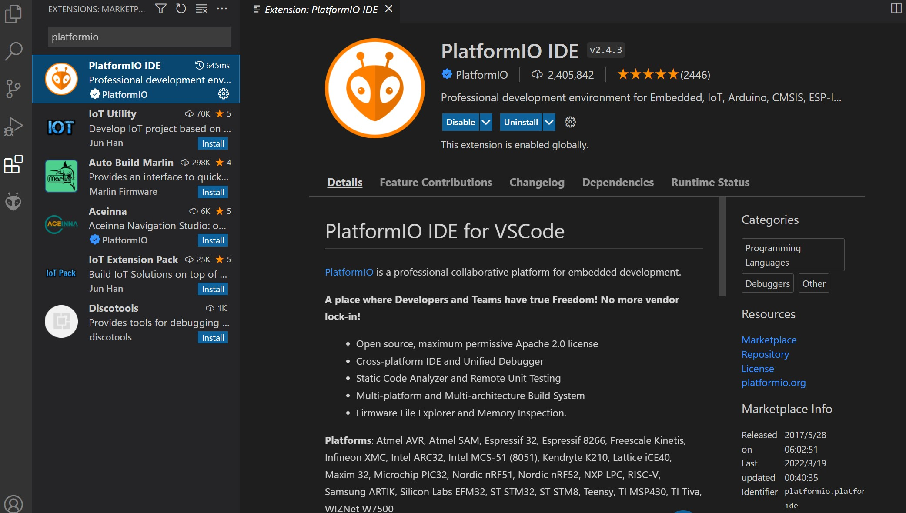
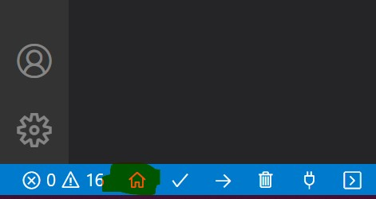
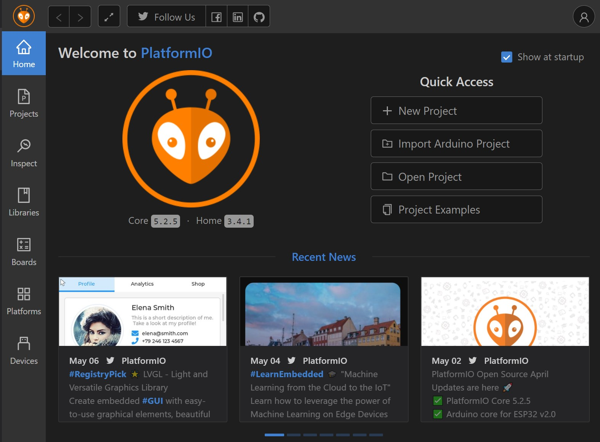
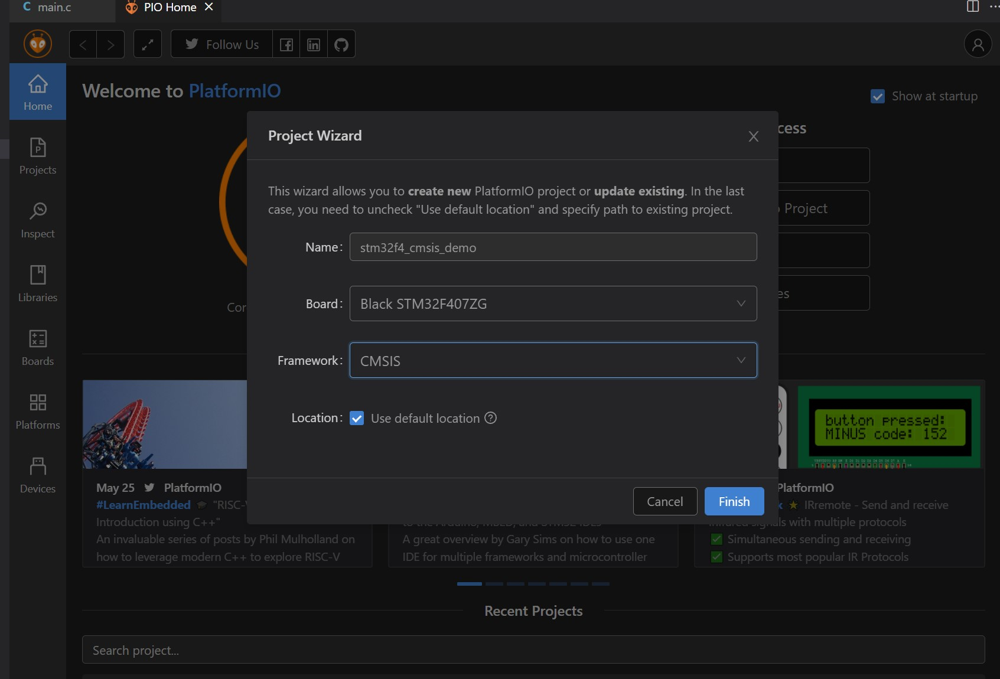

# stm32f4_cmsis_demo

## 在VSCode中使用PlatformIO插件进行stm32的开发

### 开发环境配置

- 安装VSCode。

- 在`Extensions`中搜索`PlatformIO`并安装。

  

- 安装成功后可以在VSCode的左下角看到一个小房子的标识。

  

- 点击这个小房子可以看到PlatformIO的主页，点击`New Project`创建新项目。

  

- `Name`为项目名称；`Board`为使用的开发板，这里我使用的是**正点原子探索者STM32F4开发板**；`Framework`为开发框架，本项目使用**库函数**进行开发，选择CMSIS，还有其他的开发框架可供选择；`Location`为项目位置。

  

- 完成设置后点击`Finish`。首次创建新Board或新Framework时，等待过程会比较漫长，这个过程中可以去做其他事情了。

- 创建成功后，对正点原子“标准例程-库函数版本”中的“实验一 跑马灯实验”进行移植。

- 将正点原子例程中的CORE、HARDWARE、FWLIB、SYSTEM文件夹复制到项目src文件夹目录下。

- 将项目src/CORE文件夹下的`startup_stm32f40_41xxx.s`文件删除。

- 将正点原子例程中USER目录下的文件：

  ```
  stm32f4xx_conf.h
  stm32f4xx_it.h
  stm32f4xx.h
  system_stm32f4xx.h
  ```

  复制到项目include文件夹下。

- 将正点原子例程中USER目录下的文件：

  ```
  main.c
  stm32f4xx_it.c
  ```

  复制到项目src文件夹下。

- 将项目src/FWLIB/src中的`stm32f4xx_fmc.c`删除；项目src/FWLIB/inc中的`stm32f4xx_fmc.h`删除。

- 将项目src/SYSTEM/sys.c文件修改为：

  ```
  #include "sys.h"  
  
  void WFI_SET(void){
  	__ASM volatile("WFI");
  }
  
  void INTX_DISABLE(void){
  	__ASM volatile("CPSID   I");
  	__ASM volatile("BX      LR");
  }
  
  void INT_ENABLE(void){
  	__ASM volatile("CPSIE   I");
  	__ASM volatile("BX      LR");
  }
  
  void MSR_MSP(u32 addr){
  	__ASM volatile("MSR MSP, r0");
  	__ASM volatile("BX r14");
  }
  ```

- 修改配置文件platformio.ini：

  ```
  [env:black_f407zg]
  platform = ststm32
  board = black_f407zg
  framework = cmsis
  upload_protocol = stlink
  debug_tool = stlink
  
  build_flags = 
      -I src/CORE
      -I src/FWLIB/inc
      -I src/SYSTEM/delay
      -I src/SYSTEM/sys
      -I src/SYSTEM/usart
      -I src/HARDWARE/LED
  
      -D STM32F40_F41xxx
      -D USE_STDPERIPH_DRIVER
  ```
  
- 点击左下角的`√`进行编译。

- 编译通过后再点击左下角的`->`下载至开发板上。

- 下载成功后，即可看到开发板上的led开始闪烁。